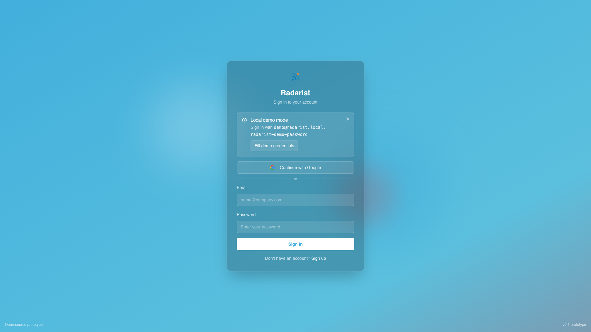
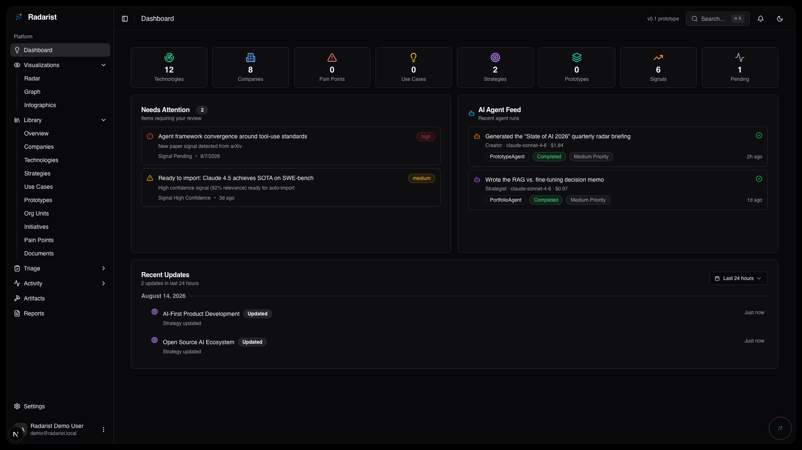
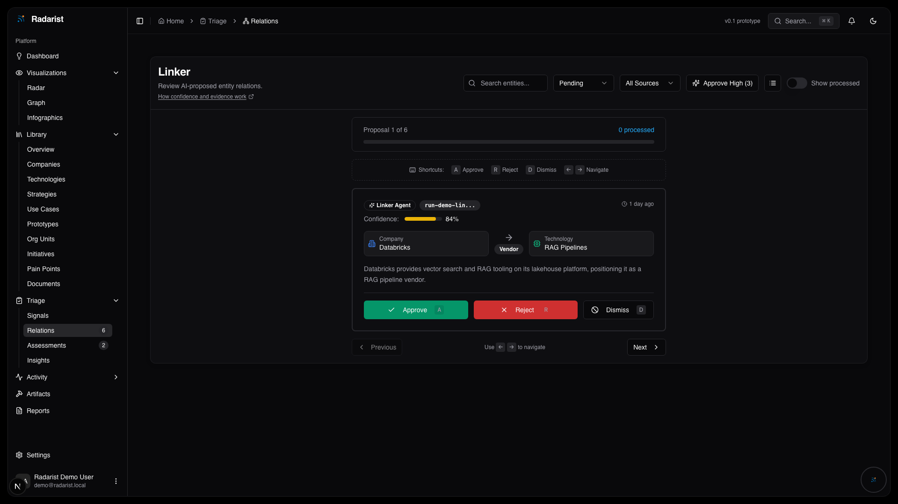
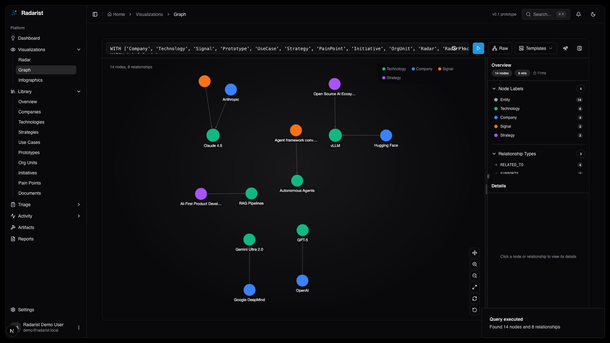
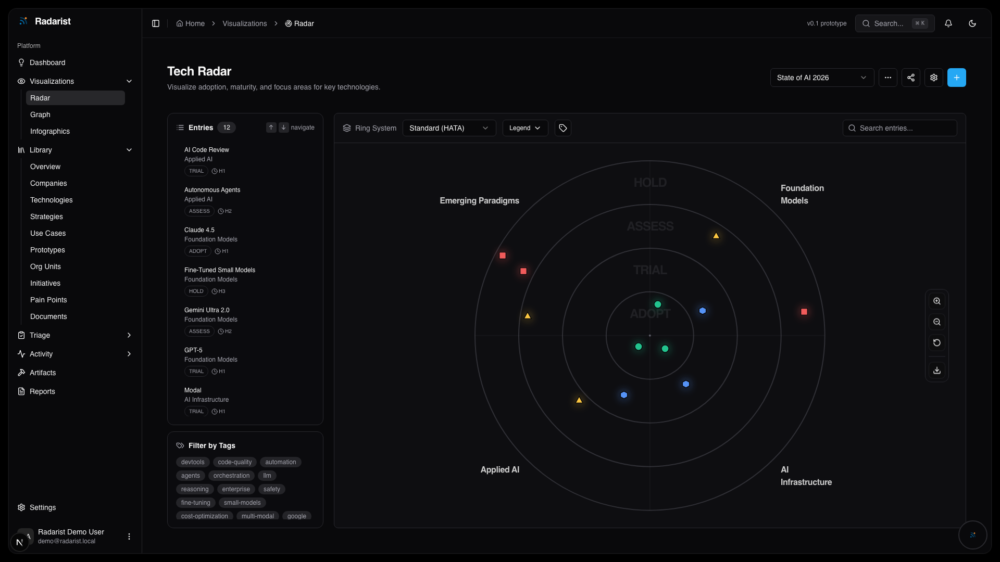
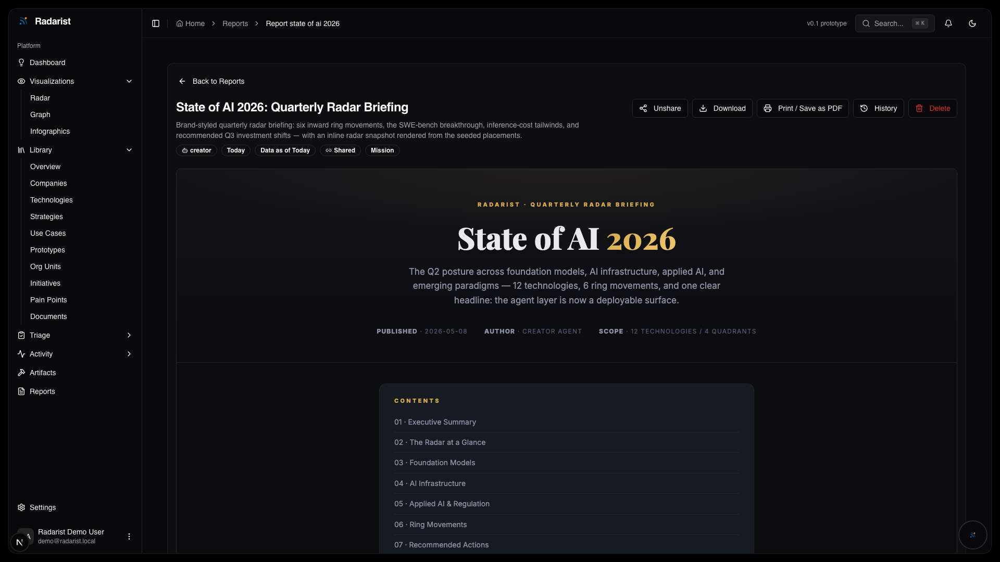

# Radarist

**Version:** `0.1.0`
**Status:** Local-first v0.1 prototype release

Radarist is an experimental technology-intelligence workspace. It helps an
operator turn weak signals into reviewable decisions through one core loop:

> signal -> entity -> relation -> radar -> report

The v0.1 release is designed for evaluation on one machine. It is not a hosted
service, a production deployment template, or a substitute for human judgment.
The public product narrative is also available at [www.radarist.ai](https://www.radarist.ai/).

## What you can explore

- collect and triage technology signals;
- organize companies, technologies, use cases, and strategies as entities;
- propose and review evidence-backed relationships;
- place technologies on a configurable radar;
- draft reports with citations, confidence, and explicit review steps;
- inspect the graph and use the in-tree MCP surface from a local client.

AI-generated claims, scores, links, and reports are drafts. Verify them against
their cited sources before making a decision.

## Screenshots

| Surface | Preview |
| --- | --- |
| Local sign-in |  |
| Dashboard |  |
| Relation triage |  |
| Knowledge graph |  |
| Technology radar |  |
| Report draft |  |

## Quick start

Requirements:

- Node.js `^20.19.0 || ^22.12.0 || ^24.0.0` and npm `11.5.1`;
- Docker for the local Neo4j service;
- Java 21 for the Firebase emulator suite;
- curl `8.4.0` or newer for checksum-verified Neo4j GDS provisioning;
- enough local disk for dependencies, emulator data, and Docker images.

```bash
git clone https://github.com/radarist/radarist.git
cd radarist
npm ci
npm run setup:local
npm run doctor
```

Then choose how the local workspace should start:

| Start mode | Command | First start | What survives a clean restart |
| --- | --- | --- | --- |
| Persistent showcase (default) | `npm run demo:full` or `npm run demo:full -- --showcase` | Creates a local login and curated signals, entities, relations, radar, and report examples. | Firebase, Neo4j, and Inngest data, including your later edits. |
| Persistent blank | `npm run demo:full -- --blank` | Creates the local login but no showcase entities. | Everything you create in the blank workspace. |
| Disposable showcase | `npm run demo:full -- --ephemeral` | Creates an isolated one-run showcase. | No workspace data; clean shutdown removes its Firebase, Neo4j, and Inngest state. |
| Disposable blank | `npm run demo:full -- --blank --ephemeral` | Creates an isolated empty workspace with only the local login. | No workspace data. |

`--showcase` and `--blank` seed only a fresh profile. A persistent restart
restores the newest verified workspace instead of overwriting it, even if you
change the seed flag. Use the guarded reset below when you genuinely want to
start that profile over.

Open `http://127.0.0.1:9002`. With the generated defaults, a freshly seeded
workspace creates:

```text
demo@radarist.local
radarist-demo-password
```

The launcher's printed `Login` line is authoritative. An existing persistent
workspace restores its saved Firebase Auth accounts, and an operator-supplied
local password may replace the generated default shown above.

All four modes use loopback-bound Firebase emulators, Neo4j, Inngest, and the
Next.js application. Seeded exploration does not require an AI provider key.
Provider features are opt-in and may incur charges under your provider account.

Stop the launcher with `Ctrl+C` so it can finish bounded cleanup. Persistent
mode writes a final verified Firebase checkpoint and keeps the profile-owned
Neo4j volumes and Inngest queue. To start over, first preview the exact targets:

```bash
npm run demo:reset -- --profile default --include-neo4j
```

[Getting started](docs/getting-started.md) shows the confirmed reset command and
explains which local files remain untouched.

For a smaller setup walkthrough, environment templates, and recovery commands,
read [Getting started](docs/getting-started.md) and
[Environment](docs/ENVIRONMENT.md).

## Important v0.1 boundary

Build missions and their sandbox are **experimental, default-off, and not a
qualified or supported v0.1 feature**. Enabling them can resolve mutable
external executables outside the qualified root and Agent lockfiles. Do not use
that path for sensitive or reproducible work. Pinning the sandbox image and its
tool bundle is intentionally deferred until after v0.1.

The local application has additional prototype limitations. In particular, do
not expose it to an untrusted network or treat generated analysis as verified
fact. Read [Security](SECURITY.md), [Limitations](docs/LIMITATIONS.md), and
[Responsible AI](docs/RESPONSIBLE-AI.md) before enabling provider-backed flows.

## Documentation

- [Documentation index](docs/README.md)
- [Getting started](docs/getting-started.md)
- [Architecture](docs/HIGH_LEVEL_ARCHITECTURE.md)
- [Environment](docs/ENVIRONMENT.md)
- [Quality gates](docs/QUALITY-GATES.md)
- [Capabilities](docs/CAPABILITIES.md)
- [Confidence, evidence, and feedback](docs/guides/confidence-evidence-and-feedback.md)
- [MCP overview](docs/mcp/README.md)
- [Agent runtime](agent/README.md)

## Generated capability summary

<!-- CAPABILITIES:START -->
_Generated from the capability catalog — do not edit between the markers; run `npm run capabilities:generate`._

**56 analytical skills** across 5 categories:

- **Analysis & forecasting** (16) — analysis-of-competing-hypotheses, apply-hype-cycle, assess-research-momentum, bayesian-update, brier-score-calibration, cynefin-classification, estimate-market-size, evolution-stage, five-forces-analysis, foresight, jtbd-framing, position-competitor, scenario-planning, score-technology-readiness, three-horizons, weak-signal-triage
- **Critique & rigor** (11) — abstain-or-escalate, assess-study-bias, benchmark-model-claims, cheapest-experiment, critique-report, key-assumptions-check, premortem-analysis, quantitative-sanity-check, red-team-claim, steelman-argument, test-significance
- **Domain checks** (7) — analyze-patent-claims, analyze-release-notes, chemistry-claim-check, detect-funding-round, detect-ma-event, read-patent-landscape, smiles-sanity-check
- **Reporting & radar** (8) — design-pass, discover-relations, evaluate-signal, generate-radar-report, pyramid-principle, verify-entity, write-imrad-report, write-srl-brief
- **Research & evidence** (14) — cite-ieee, claim-provenance, decompose-research-question, graph-as-instrument, grounded-answer, grounded-fact-check, oss-project-health, rate-source-admiralty, research-company, research-technology, sift-source-check, systematic-review, triangulate-sources, verify-citations

**7 mission profiles** — creator · curator · defense-minister · evaluator · linker · scout · strategist

**6 keyless research tools** — searchPapers · resolveOpenAccess · searchHackerNews · searchSecFilings · searchOssHealth · searchPatents (no API key required)

**4 platform features** — research-missions · build-missions · limitless-build-mode · technology-evaluations (see `docs/CAPABILITIES.md` for status)

**Keyless data sources** — OpenAlex, Crossref, Semantic Scholar, Unpaywall, Hacker News (Algolia), SEC EDGAR, Ecosyste.ms, Google Patents. Data: Ecosyste.ms (CC-BY-SA 4.0).
<!-- CAPABILITIES:END -->

## Project policy

This repository is published as a reference prototype. GitHub Issues are the
sole inbound project channel. The project does not offer a pull-request or
contributor workflow for v0.1; see [Contributing](CONTRIBUTING.md),
[Governance](GOVERNANCE.md), and [Support](SUPPORT.md).

Radarist is licensed under the [MIT License](LICENSE). Dependency and bundled
asset notices are listed in [Third-Party Notices](THIRD-PARTY-NOTICES.md).
